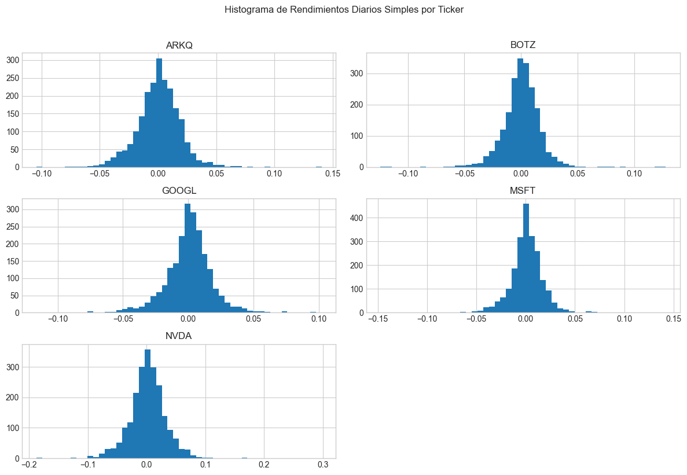
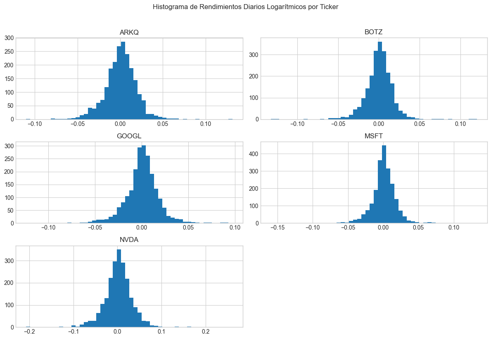
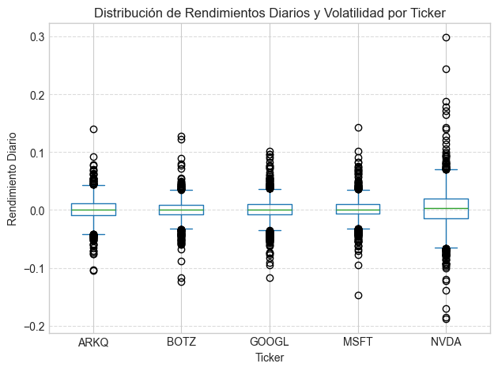
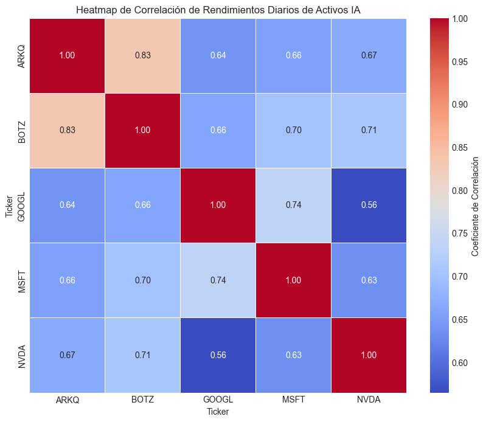

# Análisis Exploratorio de Datos Financieros en el Sector de Inteligencia Artificial

## Resumen del Proyecto

El objetivo de este proyecto es realizar un Análisis Exploratorio de Datos (EDA) detallado sobre un conjunto selecto de activos financieros relacionados con el sector de la **Inteligencia Artificial (IA)** y la tecnología. Considero que mediante el análisis de datos históricos de precios y volumen, utilizando herramientas estadísticas y de visualización en Python, se puede identificar patrones clave, tendencias, características de riesgo (volatilidad) y las relaciones (correlaciones) entre estos activos. Lo cual es una introducción interesante para este mercado. 

---

## Adquisición de Datos

Los datos se obtuvieron desde **Yahoo Finance**, los cuales se pueden derivar mediante la librería *yfinance* hacia distintos scripts de Python, en donde se transforman a diferentes formas de información. 

### Activos Seleccionados

Previamente, investigué de manera cualitativa por su impacto mediático a los siguientes tickers (conocidos también como símbolos de cotización) que representan a empresas líderes y fondos temáticos dentro del sector de la Inteligencia Artificial y tecnología:

* **NVDA**: NVIDIA Corporation
* **MSFT**: Microsoft Corporation
* **GOOGL**: Alphabet Inc. (Google)
* **BOTZ**: Global X Robotics & Artificial Intelligence ETF
* **ARKQ**: ARK Autonomous Technology & Robotics ETF

### Rango de Fechas

Los datos históricos descargados cubren el siguiente período:

* **Fecha de Inicio**: 2015-04-20
* **Fecha de Fin**: 2025-04-20 (los datos se descargan hasta la fecha de trading disponible más cercana e igual o anterior a esta)

### Fuente de Datos

Los datos históricos de precios y volumen para los tickers seleccionados fueron obtenidos utilizando la librería de Python **`yfinance`**, que accede a la información de Yahoo Finance. La descarga inicial se realizó mediante el script **`scripts/download_data.py`**, el cual guarda los datos brutos en formato CSV.

---

## Limpieza y Preprocesamiento de Datos

Una vez descargados los datos brutos (en `data/financial_data.csv`), se realiza un proceso de limpieza inicial para asegurar su calidad y prepararlos para el análisis. Estos pasos se documentaron y ejecutaron en el notebook **`notebooks/01_data_acquisition_cleaning_exploration.ipynb`**.

1.  **Manejo de Valores Nulos (NaN):** Se identificaron y manejaron los valores nulos, especialmente aquellos presentes al inicio de la serie temporal de algunos activos (como BOTZ y ARKQ, que comenzaron a cotizar después de la fecha de inicio del rango principal). Se utilizó la técnica **forward fill (`ffill()`)** para rellenar los valores faltantes dentro de cada serie temporal, entendiendo que los `NaN` iniciales representan períodos donde el activo no existía.
2.  **Almacenamiento de Datos Procesados:** Tras la limpieza, los datos procesados y listos para el análisis fueron guardados en un archivo en formato **Parquet** (`ai_stocks_historical_data_cleaned.parquet`), ubicado en la subcarpeta **`data/processed/`**. Este formato es eficiente para el almacenamiento y carga de DataFrames de Pandas en análisis posteriores.

**Datos procesados guardados en**: `data/processed/ai_stocks_historical_data_cleaned.parquet`

---

## Análisis Exploratorio de Datos (EDA)

Esta es la sección principal donde se presentan los resultados y hallazgos del análisis exploratorio realizado sobre los datos limpios. Los análisis detallados se ejecutaron en el notebook **`notebooks/02_exploratory_data_analysis.ipynb`**.

### Estadísticas Descriptivas Básicas

Se calcularon estadísticas descriptivas básicas (media, desviación estándar, mínimo, máximo, cuartiles, mediana) para las columnas clave (precio de cierre, volumen). Esto proporcionó una primera visión cuantitativa de la distribución, el rango y las características generales de los datos para cada activo en el período 2015-2023/2025.

      ### Análisis de Rendimientos

Se calcularon los rendimientos diarios (porcentuales y logarítmicos) para analizar los cambios de precio relativos.

* La distribución de los rendimientos diarios fue visualizada mediante **histogramas**. Estos mostraron que, para la mayoría de los días, las fluctuaciones de precio son muy pequeñas y se concentran cerca de cero. No obstante, las "colas" de la distribución (valores alejados del centro) indican la presencia de días con movimientos porcentuales significativos, aunque menos frecuentes.

     ### Análisis de Volatilidad

La volatilidad, como medida clave de riesgo, fue calculada como la desviación estándar de los rendimientos diarios y anualizada (asumiendo 252 días de trading/año).

* Se observó que activos individuales como NVDA presentaron históricamente una volatilidad anualizada notablemente mayor en comparación con ETFs más diversificados (BOTZ, ARKQ) o empresas de mayor capitalización y menor volatilidad histórica (MSFT, GOOGL). Esto refleja el mayor riesgo asociado a las fluctuaciones de precio de un activo de alto crecimiento y muy expuesto a las dinámicas del sector.
* La distribución y comparación visual de la volatilidad entre activos fue clara en el **Box Plot** de los rendimientos diarios, mostrando la dispersión de los datos y la extensión de los valores atípicos (días de movimientos extremos).

     ### Análisis de Correlación: Una Perspectiva Crítica para la Diversificación

Se calculó la matriz de correlación de los rendimientos diarios para entender la interdependencia entre los activos.

* El análisis cuantitativo (matriz numérica) y las visualizaciones (heatmap y pair plot) revelaron un **alto grado general de correlación positiva** entre la mayoría de los tickers seleccionados dentro de este nicho del sector IA. Pares como MSFT y GOOGL, así como los ETFs temáticos (que invierten en empresas similares), muestran una fuerte tendencia a que sus rendimientos diarios se muevan en la misma dirección.

      * **Reflexión sobre la Diversificación:** Este hallazgo de alta correlación positiva es una **observación crítica** para la gestión de un portafolio, ya que si bien estos activos representan una temática de inversión interesante, su fuerte tendencia a moverse juntos implica que **ofrecen beneficios de diversificación limitados entre sí**. Si el sector de la IA en general experimenta un evento negativo (sea tecnológico, regulatorio o macroeconómico), es probable que la mayoría o todos estos activos en la selección caigan simultáneamente debido a su interdependencia. 
    
    Para mejorar la diversificación y que esta sea efectiva, sería fundamental complementar esta selección de activos de IA con inversiones en **sectores, geografías o clases de activos que muestren una correlación baja o negativa** con este grupo. El análisis de correlación subraya la importancia de mirar más allá de la temática de inversión al construir un portafolio robusto.

---

## Conclusiones del EDA y Próximos Pasos

El Análisis Exploratorio de Datos ha proporcionado una base sólida y un entendimiento detallado de las características históricas de los activos de IA seleccionados, incluyendo sus tendencias de precio, perfiles de volatilidad y, crucialmente, su alta correlación interna. Este análisis es un paso fundamental y completado en nuestro proyecto de análisis financiero.

* El siguiente paso lógico en este portafolio será el **Proyecto 2: Análisis de Indicadores Financieros**, donde calcularemos y exploraremos la relación entre los precios y diversos indicadores técnicos.
* Posteriormente, el **Proyecto 3: Backtesting de una Estrategia** permitirá evaluar el rendimiento histórico de posibles enfoques de trading.
* Finalmente, el **Proyecto 4: Análisis de Sentimiento** buscará incorporar datos cualitativos (noticias) para analizar su relación con los movimientos de precios.

---